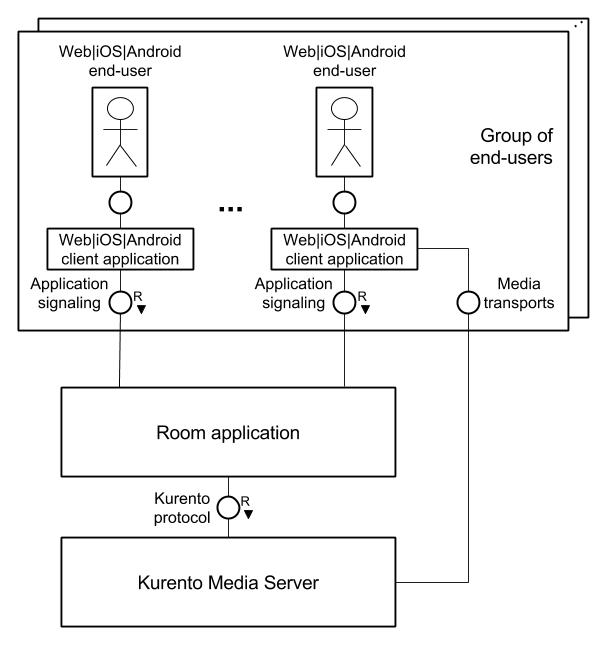
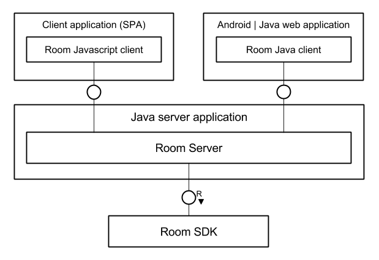

.. image:: images/kurento-rect-logo3.png
   :alt:    Kurento logo
   :align:  center

|
|

%%%%%%%%%%%%
Introduction
%%%%%%%%%%%%

At :term:`Kurento` we strive to provide services for developers of advanced 
video applications for the Web and smartphone platforms. 
We found that a common use case is represented by multi-party group calls 
requiring a media server for advanced media processing.

This project introduces the **Rooms** API, designed for the development 
of conferencing applications whose centerpiece is the :term:`Kurento Media Server`. 
The conference groups (rooms) will be managed using the API, which at the same time
provides the means to interconnect the end-users through a Kurento Media Server
instance. 

..
   Image source:
   https://docs.google.com/a/naevatec.com/drawings/d/1E1OPouyXDJzdM1P1D1nnHKd5NILkwWK_q-VEoGWBB5E/edit?usp=sharing

   *Architecture of a Room application*

The API's core module, :ref:`Room SDK <core-label>`, is a Java library for the 
server-side and has the main functionality of managing multi-conference sessions.

Additionally, we provide :ref:`extra components <extra-label>` that can be used when 
developing applications that follow the architecture depicted above:

- **Room Server**: a container-based implementation of the server, uses 
  :term:`JSON-RPC` over :term:`WebSockets` for communications with the clients
- **Room JavaScript Client**: module implementing a Room client for Web applications
  (works with the Room Server only)
- **Room Client**: a client library for Java web applications or Android clients
  (works with the Room Server only)

..
   Image source:
   https://docs.google.com/a/naevatec.com/drawings/d/1Vnrz3kjxg8ssu7bmB8xckRUYmxGpicNJH_XJ93Lhvn8/edit?usp=sharing

   *Integration of the API components*

.. _core-label:

Core API
--------

The core module defines a programming model for applications developed using the 
Java language. Some of the benefits from using this library:

- control over the lifecycle of a :term:`multimedia` conference (**room**)
- access to typical operations required for managing the participants (join, exit,
  publish or receive media streams, etc.)
- simple media signaling, the application is required only to provide the media 
  initialization and negotiation parameters received from the clients
- multimedia legs or service topologies are hidden by default (:term:`media elements` 
  like image filters can still be applied to a participant's stream)   

This component requires access to at least one instance of a Kurento Media Server 
for :term:`WebRTC` media handling.

Developers can integrate this API directly into their application, but it's
important to understand that this library doesn't possess, on its own, the 
ability to communicate with the clients. Further details can be found in the 
:doc:`core API section <java_api_integration>`.

.. _extra-label:

Other components
----------------

Our *server* implementation, the Room Server, packs the functionality from the Room 
SDK with technologies such as :term:`Spring Boot` and JSON-RPC over WebSockets. As such,
it combines the client communications component and the core Room API, providing
a fully-fledged Rooms server application. 
It can be easily integrated into other applications that use the Spring Boot framework.

Both *client* libraries are designed to be used in combination with the Room Server,
as for signaling they use the JSON-RPC API exposed by our server component.

The Java client doesn't deal with media handling but only defines a Java API
over the JSON-RPC protocol supported by the Room Server.

On the other hand, the JavaScript client also controls the browser's media 
initialization and negotiation details, enabling the developer to focus on application
functionality.

At the moment, there is **no iOS client** available.

.. note::
   
   Please observe that the server's WebSocket API has a limitation concerning an 
   **user's name**, it can't contain **lower dashes** (``_``).

Integration example
-------------------

The **Room Demo** module is a :term:`Single-Page Application` based on the Room Server and the
Room JavaScript Client. It enables users to simultaneously establish multiple 
connections to other users connected to the same session or room.

.. note::

   Even though the core module is the Room SDK, developers are free to pick 
   whatever component they need in order to build their application: some might 
   need some minor modifications on the client side, whilst others would want to 
   inject their logic on server side and might even have to modify the SDK.

For example, the demo shows how to integrate some of the provided components 
together with the client-side technology :term:`AngularJS` and some small modifications 
of the server (adds a image filter for the video streams and a custom message type).

We provide a :doc:`quick_start` guide for the demo's installation
and execution.

There's also a short :doc:`developer_guide` for applications based on this API.