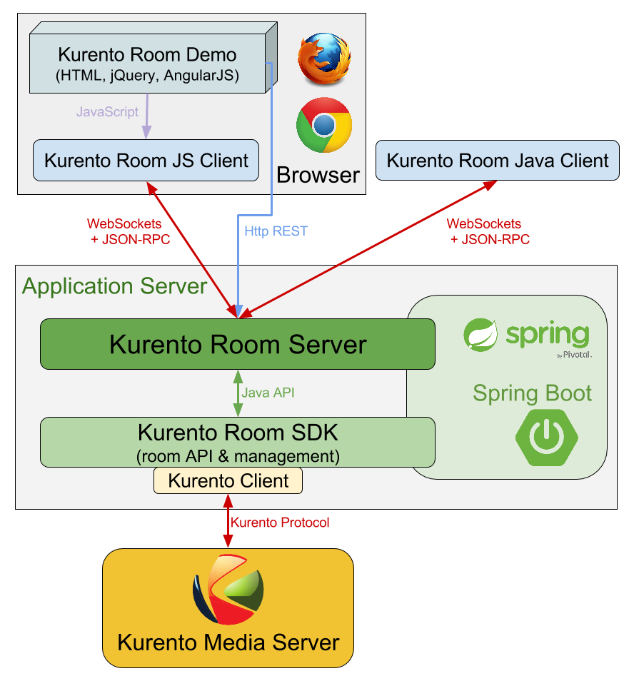

.. image:: images/kurento-rect-logo3.png
   :alt:    Kurento logo
   :align:  center

|
|

%%%%%%%%%%%%
Introduction
%%%%%%%%%%%%

At `Kurento <http://www.kurento.org/>`_ we strive to provide services for 
developers of advanced video applications for the Web and smartphone platforms. 
We found that a common use case is represented by multi-party group calls 
requiring a media server for advanced media processing.

This project introduces the **Rooms** API, designed for the development 
of conferencing applications whose centerpiece is the Kurento Media Server. The
conference groups (rooms) will be managed using the API, which at the same time
provides the means to interconnect the end-users through a Kurento Media Server
instance. 

..
   Image source: //TODO !!!
   https://docs.google.com/a/naevatec.com/drawings/d/....

.. figure:: images/room-top-arch.png
   :align:   center 
   :alt: Architecture of a Room application

   *Architecture of a Room application*

The API's core module, :ref:`Room SDK <core-label>`, is a Java library for the server-side
which offers the main functionality for managing multi-conference sessions. 

Additionally, we provide :ref:`extra components <extra-label>` that can be used when 
developing applications that follow the architecture depicted above:

- **Room Server**: a container-based implementation of the server, uses JSON-RPC 
  over WebSockets for communications with the clients
- **Room Javascript Client**: module implementing a Room client for Single Page 
  Applications (works with the Room Server only)
- **Room Client**: a client library for Java web applications or Android clients
  (works with the Room Server only)

..
   Image source: //TODO !!!
   https://docs.google.com/a/naevatec.com/drawings/d/....

.. figure:: images/room-components-integration.png
   :align:   center 
   :alt: Integration of the API components

   *Integration of the API components*

.. _core-label:

Core API
--------

The core module defines a programming model for applications developed using the 
Java language. Some of the benefits from using this library:

- control over the lifecycle of a multimedia conference (room)
- access to typical operations required for managing the participants (join, exit,
  publish or receive media streams, etc.)
- simple media signaling, the application is required only to provide the media 
  initialization and negotiation parameters received from the clients
- multimedia legs or service topologies are hidden by default (multimedia elements 
  like filters can still be applied to a participant's stream)   

This component requires access to at least one instance of a Kurento Media Server 
for WebRTC media handling.

.. _extra-label:

Other components
----------------

Our *server* implementation, the Room Server, packs the functionality from the Room 
SDK with technologies such as Spring Boot and JSON-RPC over WebSockets. As such,
it combines the client communications component and the core Room API, providing
a fully-fledged Rooms server application. Can be easily integrated into other applications
that use the Spring Boot framework.

Both *client* libraries are designed to be used in combination with the Room Server,
as they use the same JSON-RPC API.

The Java client doesn't deal with media handling but exposes only a Java API
over the JSON-RPC protocol supported by the Room Server.

On the other hand, the Javascript client also controls the browser's media 
initialization and negotiation details, enabling the developer to focus on application
functionality.

At the moment, there is no iOS client available.

Integration example
-------------------

The **Room Demo** module is a Single Page Application based on the Room Server and the
Room Javascript Client. It enables users to simultaneously establish multiple 
connections to other users connected to the same session or room.

Please note that even though the core module is the Room SDK, developers are free to pick 
whatever component they need in order to build their application: some might 
need some minor modifications on the client side, whilst others would want to 
inject their logic on server side and might even have to modify the SDK.

For example, the demo shows how to integrate some of the provided components together with
the client-side technology Angular JS and some small modifications of the server
(adds a image filter for the video streams and a custom message type).

..
   Image source:
   https://docs.google.com/a/naevatec.com/drawings/d/1I3Upj-vMlEtBkt0InWNKQ2ChpzhoS73wf7dgvDqcjug/edit?usp=sharing

   
   *Kurento Room integration*

We provide a :doc:`quick start <quick_start>` guide for the demo's installation
and execution.

Development hints
-----------------

These are some of the design and architecture requirements that an application 
has to fulfill in order to use the Room API:

- include the SDK module to its dependencies list
- create one of the two `RoomManager` types as a singleton instance by 
  providing implementations for the following interfaces: 

  - ``RoomEventHandler``
  - ``KurentoClientProvider``

- develop the client-side of the application for devices that support WebRTC
  (*hint:* or use our **client-js** library and take a look at the demo's client 
  implementation)
- design a room signaling protocol that will be used between the clients and
  the server (*hint:* or use the WebSockets API from ``kurento-room-server``) 
- implement a handler for clients' requests on the server-side, that will
  use the ``RoomManager`` to process these requests (*hint:* JSON-RPC handler
  from ``kurento-room-server``)
- choose a response and notification mechanism for the communication with the
  clients (*hint:* JSON-RPC notification service from ``kurento-room-server``)

About the technology stacks that can or should be used to implement a Rooms 
application: 

- WebSockets for the communications between the server and the clients
- Spring and Spring Boot for the easy configuration and integration with some 
  of Kurento's modules. It also provides a WebSockets library.

And of course, the main requirement is at least one installation of the Kurento
Media Server, accessible to the room application.