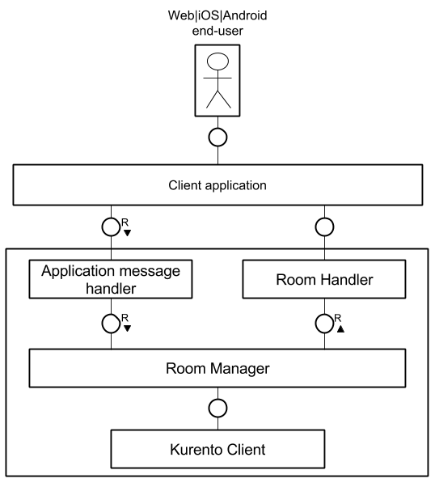
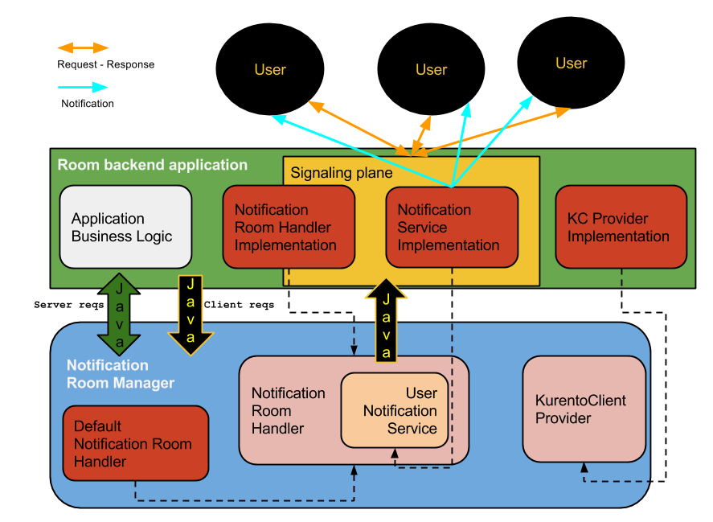

%%%%%%%%%%%%%%
Rooms Core API
%%%%%%%%%%%%%%

The Rooms API is based on the **Room Manager** abstraction. This manager can organize 
and control multi-party group calls with the aid of :term:`Kurento` technologies. 

We understand this library as an SDK for any developer that wants to implement 
a Room server-side application.

The Room Manager's Java API takes care of the room and media-specific details, freeing
the programmer from low-level or repetitive tasks (inherent to every multi-conference 
application) and allowing her to focus more on the application's functionality or 
business logic.

Understanding the API
=====================

The manager deals with two main concepts:

- **rooms** - virtual groups of peers, with the limitation that an user can be 
  belong to only one at a time. To identify them we use their names.
- **participants** - virtual representation of a end-user. The application will
  provide a string representation of the user level that should suffice to 
  uniquely identify this participant.

Given the nature of the applications using our API, it's expected that the 
end-users will try to connect to existing rooms (or create new ones) and 
publish or receive media streams from other peers.

When using this SDK, the application's job is to receive and translate *messages* 
from the end-users' side into *requests* for a Room Manager instance.

Some of API's methods not only deal with room management, but also with 
the media capabilities required by the participants. The underlying media 
processing is performed through a library called :term:`Kurento Client`,
which can raise events when certain conditions are met for some of the media
objects created by the manager. In turn, the information gathered by 
handling these events is sometimes required to be notified to the end-user.
The manager notifies the application of the most important events by using an 
interface called **Room Handler**, for which the application must provide an
implementation. 

..
   Image source:
   https://docs.google.com/a/naevatec.com/drawings/d/17wBlhu7k8Pu3piAwseAbF4L_8ezgCdP2rcMUkZksCe4/edit?usp=sharing

   *Room Manager integration*

We provide two types of Room Manager that expose almost the same interface (the
same method names but with different signatures):

- ``org.kurento.room.RoomManager``: the default implementation.
- ``org.kurento.room.NotificationRoomManager``: an implementation that defines 
  a model for sending the notifications or the responses back to the clients.

RoomManager
===========

There are two requirements for creating a new (regular) room manager, and they 
are to provide implementations for:

- the Room Handler in charge of events triggered by internal media objects
- a Kurento Client Manager that will be used to obtain instances of Kurento Client

For client-originated requests, the application is required to inform the
remote parties of the outcome of executing the requests, such as informing all
participants in a room when one of them has requested to publish her media.

There is another type of methods that attend to application-originated requests
(or business logic), in this case the application if free to interpret the
result and to act upon it.

Events - RoomHandler
====================

In order to act upon events raised by media objects, such as new :term:`ICE` 
candidates gathered or media errors, the application has to provide an event
handler. Generally speaking, these are user-orientated events, so the application 
should notify the corresponding users.

Room and RoomHandler relations
------------------------------

The following is a table detailing the server events that will resort to methods 
from Room Handler.

+------------------------+---------------------+
| **Events**             | **RoomHandler**     |
+------------------------+---------------------+
| gathered ICE candidate | onSendIceCandidate  |
+------------------------+---------------------+
| pipeline error         | onPipelineError     |
+------------------------+---------------------+
| media element error    | onMediaElementError |
+------------------------+---------------------+

NotificationRoomManager
=======================

There are two requirements when instantiating a notification room manager, and 
they are to provide implementations for:

 - a communication interface that can send messages or notifications back to
   the application's end users AND/OR a notification room event handler that
   will take the control over the notifications' lifecycle
 - a Kurento Client Manager that will be used to obtain concrete instances
   of Kurento Client

The room event handler has been designed to provide feedback to the application
with the result obtained from processing a user's request.

The notification managing API considers two different types of methods:

 - **server domain** - consists of methods designed to be used in the
   implementation of the application's logic tier and the integration with the
   room SDK. The execution of these methods will be performed synchronously.
   They can be seen as helper or administration methods and expose a direct
   control over the rooms.
 - **client domain** - methods invoked as a result of incoming user
   requests, they implement the room specification for the client endpoints.
   They could execute asynchronously and the caller should not expect a result,
   but use the response handler if it's required to further analyze and process
   the client's request.

The following diagram describes the components that make up the system when using
the notifications room manager:

..
   Image source:
   https://docs.google.com/a/naevatec.com/drawings/d/1sAng_Gp3CtZHuTOacHJT8_tlcEdgmUIRvaQy9OrhpUM/edit?usp=sharing

   *Notification Room Manager*

Notifications design - UserNotificationService
==============================================

This specification was planned so that the room manager could send
notifications or responses back to the remote peers whilst remaining isolated
from the transport or communications layers. The notification API is used by
the our implementation of the ``NotificationRoomHandler`` (the class
``DefaultNotificationRoomHandler``).

The API's methods were defined based on the protocol :term:`JSON-RPC` and its messages
format. It is expected but not required for the client-server communications to
use this protocol.

It is left for the developer to provide an implementation for this API.

If the developer chooses another mechanism to communicate with the client, they
will have to use their own implementation of ``NotificationRoomHandler`` which
will completely decouple the communication details from the room API.

Notifications design - NotificationRoomHandler
==============================================

Through this interface, the room API passes the execution result of client
primitives to the application and from there to the clients. It's the
application's duty to respect this contract. These methods all return ``void``.

Several of the methods will be invoked as a result of things happening outside
of a user request scope: room closed, user evicted and the ones inherited from
the ``RoomHandler`` interface.

NotificationRoomManager and NotificationRoomHandler relations
-------------------------------------------------------------

The following is a table detailing the methods from the
``NotificationRoomManager``  that will resort to methods from
``NotificationRoomHandler`` (also inherited methods).

+---------------------------------------+-----------------------------+
| **NotificationRoomManager**           | **NotificationRoomHandler** |
+---------------------------------------+-----------------------------+
| joinRoom                              | onParticipantJoined         |
+---------------------------------------+-----------------------------+
| leaveRoom                             | onParticipantLeft           |
+---------------------------------------+-----------------------------+
| publishMedia                          | onPublishMedia              |
+---------------------------------------+-----------------------------+
| unpublishMedia                        | onUnpublishMedia            |
+---------------------------------------+-----------------------------+
| subscribe                             | onSubscribe                 |
+---------------------------------------+-----------------------------+
| unsubscribe                           | onUnsubscribe               |
+---------------------------------------+-----------------------------+
| sendMessage                           | onSendMessage               |
+---------------------------------------+-----------------------------+
| onIceCandidate                        | onRecvIceCandidate          |
+---------------------------------------+-----------------------------+
| close room (Server action)            | onRoomClosed                |
+---------------------------------------+-----------------------------+
| evict participant (Server action)     | onParticipantEvicted        |
+---------------------------------------+-----------------------------+
| gathered ICE candidate (Server event) | onSendIceCandidate          |
+---------------------------------------+-----------------------------+
| pipeline error (Server event)         | onPipelineError             |
+---------------------------------------+-----------------------------+
| media element error (Server event)    | onParticipantMediaError     |
+---------------------------------------+-----------------------------+

KurentoClientProvider
=====================

This service was designed so that the room manager could obtain a Kurento Client 
instance at any time, without requiring knowledge about the placement of the 
:term:`KMS` instances.

It is left for the developer to provide an implementation for this interface.

POJOs
=====

The following classes are used in the requests and responses defined by the
Rooms API.  

- ``UserParticipant`` - links the participant's identifier with her user name 
  and a flag telling if the user is currently streaming media.
- ``ParticipantRequest`` - links the participant's identifier
  with a request id (optional identifier of the request at the communications
  level, included when responding back to the client; is nullable and will be
  copied as is). Used in the notification variant of the **Room Manager**.
- ``RoomException`` - runtime exception wrapper, includes:

   - ``code`` - Number that indicates the error type that occurred
   - ``message`` - String providing a short description of the error
